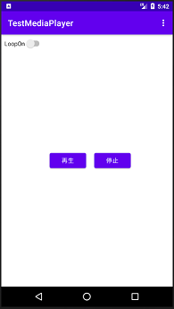
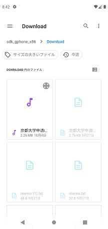

# 1. MediaPlayer
　Android端末に元々インストールされているファイルピッカーを用い、SDカードにある(DownLoadフォルダ)から保存されているmp3ファイルを読み込んで再生する骨格を作り込んだ。

　オリジナルは、斎藤著「Androidアプリ開発の教科書Kotlin対応」を基本とし、Uriを用いてDownloadフォルダなどに保存してあるmp3ファイルを開く。

MediaPlayerのインスタンスは、MediaPlayer.create()メソッドを使わず、setDataSource()メソッドを用い、当該メソッドにUriをあたえる基本的な方法で生成した。

　　

